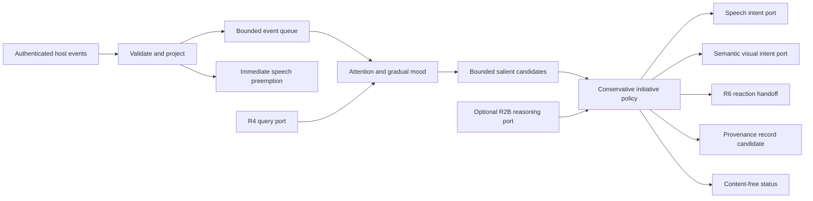

# R7A Director foundation

Status: accepted implementation baseline from the user-supplied R7A requirements.
Base: `4c35d4a048b4f06aa490aad69a7dc68da4c38eb8`.

## Purpose and scope

The Director selects bounded companion intentions from current evidence. Silence remains the default.
This foundation belongs to `services/companion-core/src/director`. It does not connect to production Stage.
R4 retains memory persistence. R6 retains media admission. Visual Presence retains animation ownership.
R2B retains provider selection, profiles, quotas, and credentials. Companion Ops integration exposes types only.

## Architecture

## Invariants

1. Proactive speech starts disabled. Only trusted user control enables it.
2. Idle duration creates no candidate. Unknown presence never establishes absence or a shared experience.
3. User speech preempts queued and active output before normal queue processing.
   Companion voice activity echoes an opaque live output ID. Owned speech retains its lease while unrelated output preempts it.
4. Active or unknown media dialogue blocks speech. Watch reactions always pass through R6.
5. Private mode clears ephemeral memory and pending work. Quiet mode blocks speech and visual reactions.
6. External text never reaches control parsing, model instructions, or a tool request.
7. Each Director belongs to one user and character. Events and recall require matching ownership.
8. Memory selection requires active, valid, current R4 items with actual, non-invalidated provenance.
9. Cancellation aborts active output and asynchronous work. Late results cannot change state or produce output.
10. No perpetual timer or model poll exists. Hosts advance local state on events or explicit clock advancement.

## Event contracts

Each event has an opaque ID, user/character identity, and acquisition timestamp.
Conversation events contain request identity and structured significance flags. They contain no message text.
Speech events contain the speaker and active flag. Activity evidence names its source and confidence.
Watch events use the existing `WatchSnapshot`. Screen events use the existing `CurrentWorld`.
Ingress copies numeric timing, state enums, and opaque fingerprints. It discards titles, captions, summaries, and raw media.
Recall events contain one bounded query for the existing R4 query interface. Query text remains ephemeral.
Record events contain existing provenance and a canonical message reference. R7 never fabricates a memory observation.
Memory invalidation events clear continuity and revoke decisions that depend on it.
Follow-ups and memory-bearing speech keep actual item/version support and expire with that supporting evidence.

## State and policy

Attention distinguishes conversation, user speech, companion speech, watching media, watching anime, working, idle, absent, and unknown.
Speech evidence has a bounded lease. Explicit activity declarations have a longer lease than observed input.
Screen activity stays tentative. A visual frame never proves anime playback, user absence, or user intent.
Screen keys incorporate source generation. Non-fresh R5 states revoke queued and live screen reactions at ingress.
Screen effect deadlines remain tied to capture acquisition rather than inference completion.
Expired or low-confidence watch evidence leaves a known media context with unknown dialogue.
Only an explicit R6 idle or cancelled snapshot clears that context. Expiry never proves playback stopped.
Mood has bounded valence, arousal, and warmth. Elapsed time returns mood gradually toward its baseline.
Emotional reactions expire separately. Mood updates have a time gate, so event storms cannot cause abrupt mood changes.
Energy is a separate gradual activity score. It uses leased attention evidence and returns toward neutral after expiry.
It never represents fatigue or a subjective feeling. Relationship context consists of separate R4 evidence.

Salience ranks direct requests, unresolved requests, significant continuation, preferences/corrections, watch moments, fresh observations, and memory threads.
Repeated request IDs and observation fingerprints receive suppression windows. Low-value routine events produce no candidate.
Initiative selects `SPEAK`, `SILENT_VISUAL_REACTION`, `REMEMBER`, `WAIT`, or `DO_NOTHING`.
Direct user responses remain reactive. Continuation and memory follow-ups require proactive speech opt-in.
Working, typing, quiet periods, absence, unknown attention, cooldowns, and hourly budgets constrain initiative.

## Bounds

| Resource | Hard bound |
| --- | --- |
| Event queue | 128 projected events |
| Events per flush | 32 by default, 128 maximum |
| Event IDs | 256 entries, five-minute expiry |
| Salient candidates | 16 entries, at most 30 seconds each |
| Repeat fingerprints | 128 entries |
| Decision history | 64 content-free decisions |
| R4 recall | One request, eight items, 2,400 text bytes, 16 KiB total retained metadata, 150 ms deadline |
| Optional reasoning | One active request, four attempts per hour, five-minute spacing, five-second deadline |
| External output | One active request, evidence deadline, at most 30 seconds |
| Standalone visual lease | Six seconds, abortable after synchronous acceptance |
| Model response | 16 KiB and 1,024 fragments |
| Proactive speech | Four attempts per hour, three-minute minimum spacing |
| Visual reactions | Frequency-dependent spacing and rolling hourly budget |
| Quiet periods | Eight daily intervals with explicit UTC offset |

## Integration ports

`SpeechIntentPort` receives a purpose and actual evidence references. It owns wording through existing conversation routing.
It must revalidate the supplied guard before output and honor the signal throughout speech.
`VisualIntentPort` receives semantic behavior, activity, and intensity. It contains no bone, axis, or renderer data.
After Vivid integration, the host maps these intents onto its actual `VisualBehaviorPort`.
`WatchReactionPort` receives the existing `ReactionCandidate`, modality, semantic affect, guard, and cancellation signal.
The handoff must resolve only after R6 admits and completes the requested reaction, declines it, or cancels it.
`WatchReactionRelay` connects that contract to `CompanionWatch.offerReaction` and the existing admitted-permit callback.
The relay owns one handoff and adds no admission policy. R6 remains the only media timing owner.
Spoken handoffs retain the actual request ID, speech purpose, tone, and R4 evidence. Admission never loses the user's request.
The relay aborts delivery at the earlier Director or R6 deadline, including with a virtual clock.
`MemoryQueryPort` remains the exact R4 interface. A separate record-candidate port accepts canonical provenance references.
`GatewayReasoningPort` sends bounded, text-free state through the existing loopback R2B reasoning alias.
Model output can select silence or a visual affect. It cannot authorize speech, invent memory, or invoke tools.
Ops consumers receive detached configuration and status. Authentication and frontend wiring remain outside this subsystem.

## Security and privacy

The public ingress validates and projects events with Valibot. Control changes use a separate trusted API.
Diagnostics contain enums, scores, timestamps, resource counts, and failure categories. They contain no user query or memory text.
Private mode and disable clear queues, continuity, salience, active leases, and owned work.
Model failures defer the candidate without retrying. Local/cloud/hybrid routing remains the gateway's responsibility.
The reasoning adapter requires a loopback gateway URL and a configured reasoning alias. It never calls a provider directly.
No Director module writes a database, private transcript, frame, caption, audio buffer, or personal-history claim.

## Implementation sequence and verification

1. Write failing tests for default silence, attention expiry, gradual mood, interruptions, and bounded storms.
2. Implement contracts, validated projection, evidence state, salience, and conservative local decisions.
3. Write failing tests for R4 provenance, corrections, watch admission, reasoning failure, cancellation, and identity isolation.
4. Implement bounded asynchronous lanes, watch relay, and the existing-gateway reasoning adapter.
5. Simulate multi-hour sessions and sustained idle with a virtual clock. Measure CPU, heap, and retained state.
6. Run affected tests/typecheck, root typecheck/lint, and independent code review. Correct important findings.
7. Document exact future wiring and measured evidence. Commit and push the foundation branch without merging.

## Review focus

- Speech ingestion must interrupt output even when the normal queue is full.
- Late recall or model results must remain inert after cancellation, privacy, disable, or memory correction.
- Watch visual reactions must use R6 admission. Silent reactions cannot bypass the media cooldown.
- Status and reasoning requests must never reveal subtitles, private queries, or memory text.
- Long idle and fresh-but-repeated observations must not produce autonomous chatter.
