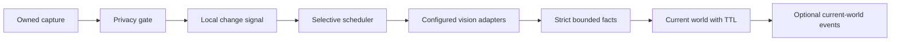

# Companion Core perception

This subsystem owns current screen awareness. It has no runtime, AIRI UI, MCP, memory, or Watch Together wiring.



## Use

Import from `src/perception/index`. Supply an app-owned capture backend and configured vision adapters.

```ts
const capture = new OwnedScreenCapture(nativeCaptureBackend)
const privacy = new PrivacyGate({ excluded_apps: ['password-manager'] })
const vision = new VisionChain({
  profile: 'cloud',
  adapters: [configuredCloudVisionAdapter],
})
const perception = new PerceptionService({ capture, privacy, vision })

perception.start()
const result = await perception.look_now()
// Consume facts only when result.status === 'fresh'.
await perception.shutdown()
```

`look_now({ authorize_unknown: true })` authorizes unknown context for that request only.
It never overrides pause, excluded applications, excluded windows, private context, lock state, or sensitive context.

## Capture contract

`ScreenCapturePort` provides capture, availability, source events, and shutdown.
`OwnedScreenCapture` wraps a persistent backend and admits one backend capture at a time.
Call `sourceChanged(available)` when the target changes or disappears. A change revokes pending leases and world facts.

Every frame carries an ID, acquisition timestamp, source identity and generation, dimensions, encoded bytes, samples, and safety metadata.
The backend supplies a fresh frame acquired after the request began.
It supplies PNG, JPEG, or WebP bytes, with a limit of 4 MiB.
Source labels have a limit of 256 characters. Dimensions have a limit of 8192 pixels per side.

The backend retains capture ownership for the app lifetime. It must respect cancellation and release native surfaces during shutdown.
The service zeros transferred encoded bytes and samples on success, failure, cancellation, and late completion.
The backend must transfer independent buffers. It cannot reuse a frame's buffers after transfer.
No product code writes screenshots to files or databases.
JavaScript strings and network copies cannot provide secure memory erasure. Buffer cleanup provides bounded retention, not a secure-erasure guarantee.

`sampleLuminance` produces a 64 by 36 grid from RGBA bytes.
It samples four points per cell and visits at most 9216 pixels.
The backend owns crop, downscale, and encoding. The sample grid is a cheap change signal, not an OCR system.

## Privacy

Privacy decisions are `ALLOW`, `BLOCK`, `LIMITED`, and `UNKNOWN`.
Automatic vision requires all three safety signals to be known false: private context, lock state, and sensitive context.
Missing signals produce `UNKNOWN`. A backend cannot convert missing metadata into a safe signal.

An application deny list matches case-insensitive application identities.
A window deny list matches case-insensitive title substrings.
Limited applications remain capture-only. R5 has no redactor and never uploads an original limited frame.

Policy updates immediately revoke pending requests and clear world state.
The service checks policy revisions before every adapter attempt, after responses, and before committing facts.
Subscriber exceptions cannot prevent revocation from reaching other subscribers.
Pause prevents capture as well as vision.

Privacy classification depends on trusted backend signals. It does not inspect passwords or sensitive text through OCR.
Production integration must expose capture consent, a visible indicator, source selection, pause, and private mode.

## Change detection and scheduling

The detector compares against the last accepted observation signature.
Minor changes accumulate until an observation succeeds.
App, window, display, title, generation, or dimension changes count as major changes.

| Signal | Classification |
| --- | --- |
| Identical sample signature and source | Unchanged |
| Small difference below meaningful thresholds | Minor |
| Mean absolute difference at least 12, or 8% of cells differ by at least 32 | Meaningful |
| Mean difference at least 70, 60% changed cells, or source identity changes | Major |

Cursor-sized changes do not trigger vision.
A black, nearly uniform frame with a video hint remains unavailable and is never uploaded.
These sample thresholds can miss small text, colors with similar luminance, or changes between sample points.

Defaults: one capture tick after each completed cycle, 1000 ms capture interval, 500 ms debounce, and 20000 ms ambient minimum interval.
Maximum idle refresh is disabled by default. Set `maximum_idle_refresh_ms` to opt in.
Manual requests bypass ambient debounce and minimum interval. They still obey provider backoff and privacy.
The service does not call vision on a fixed timer.

Hard invalidation clears the accepted signature, so an unchanged safe screen can recover after failure or privacy blocking.
A screen that reverts during cooldown restores prior facts only within their original TTL.
Unchanged samples do not extend an observation's TTL or create another VLM call.

## Vision and observations

`VisionObservationPort` advertises locality, image support, and structured-output support.
`VisionChain` selects explicitly configured, vision-capable adapters.

| Profile | Vision behavior |
| --- | --- |
| `local` | Configured local adapters only |
| `cloud` | Configured cloud adapters only |
| `cloud-mura-voice` | Same vision behavior as cloud |
| `hybrid` | Cloud first, then local only with `allow_local_fallback: true` |

No adapter or model server starts automatically. FastVLM is not configured as a fallback.
The OpenAI-compatible adapter requires HTTPS for cloud and a loopback host for local.
It rejects redirects, bounds response bytes to 32 KiB, and never exposes provider response bodies in errors.
Numeric and HTTP-date `Retry-After` values persist per adapter, including after a successful hybrid fallback.

Defaults: 7000 ms per adapter attempt, 10000 ms total vision time, and 3000 ms capture time.
Tune attempt and total limits together. A primary timeout needs remaining total time for fallback.
At most two underlying vision promises remain admitted: one superseded request and one current request.
This bound includes adapters that ignore cancellation. A stuck adapter can reduce availability until it settles.

The prompt requests literal facts and treats screen text as untrusted data.
Tools are absent. Identity recognition, sensitive attributes, hidden intentions, and full OCR output are excluded.

The schema bounds confidence, scene category, activity, text summary, six objects, optional people count, three warnings, and summary length.
Media fields cover detection, playback-like state, title-like text, and subtitle-like text.
Strict provider schemas include a nullable people count. Local validation converts null into an absent value.
Invalid output cannot enter world state. A valid schema alone does not establish scene correctness.

## Current world and events

`current()` distinguishes fresh, stale, unavailable, privacy-blocked, capture-failed, and VLM-failed states.
Only a fresh result contains observation facts.
The default TTL is 15000 ms, measured from acquisition rather than VLM completion.
Late responses cannot extend an old frame's lifetime.

Changed frames hide old facts during inference, while retaining one bounded comparison for temporal fusion.
One missing object remains uncertain for one observation. An app or window change clears that uncertainty.
Confidence below 0.5 removes text, objects, people count, and media details. It returns an explicitly uncertain summary.
Request epochs, source events, policy revisions, timestamps, and deadlines reject stale asynchronous completions.
Query snapshots are independent copies.

`PerceptionEventPort` emits new observations and status transitions without repeating identical current-state events.
It never includes frame bytes. Event failures increment a numeric counter and cannot interrupt perception.
An event consumer does not receive permission to create memories or issue tools from screen content.

## Validation

Run from `services/companion-core`:

```text
node node_modules/vitest/vitest.mjs run
node node_modules/typescript/bin/tsc --noEmit
node --import tsx eval/perception/measure.ts
node --import tsx eval/perception/live-reference.ts --model <configured-model-id> --authorize-upload
```

The live evaluator reads an existing protected credential. It does not edit runtime configuration.
It uploads six generated reference scenes, with no personal content or desktop screenshots.
The reference renderer runs in memory. Evidence contains timings and scores, not images or observation prose.
The evaluator checks scene category, useful seeded text, and limited hallucination indicators.
It does not establish accuracy on real applications, complex video, or arbitrary screens.

See `docs/r5-perception-report.md` for measurements, review fixes, and integration boundaries.
